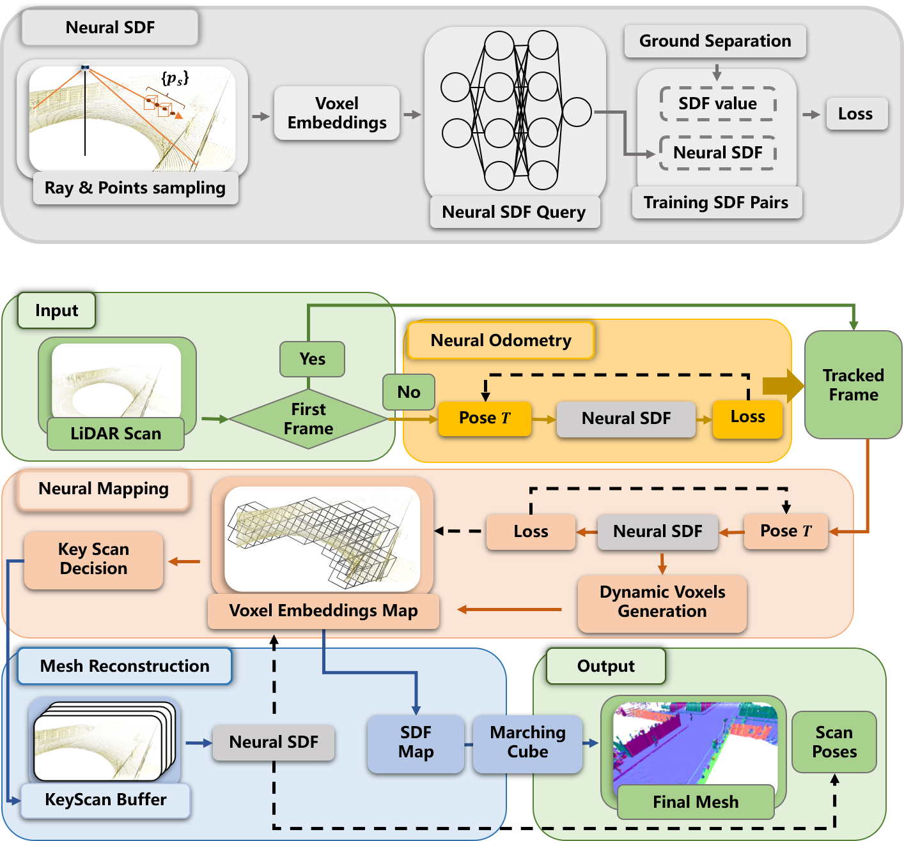

# NeRF-LOAM: Neural Implicit Representation for Large-Scale Incremental LiDAR Odometry and Mapping

This repository contains the implementation of our paper:
> **NeRF-LOAM: Neural Implicit Representation for Large-Scale Incremental LiDAR Odometry and Mapping** ([PDF](https://arxiv.org/pdf/2303.10709))\
> [Junyuan Deng](https://github.com/JunyuanDeng), [Qi Wu](https://github.com/Gatsby23), [Xieyuanli Chen](https://github.com/Chen-Xieyuanli), Songpengcheng Xia, Zhen Sun, Guoqing Liu, Wenxian Yu and Ling Pei\
> If you use our code in your work, please star our repo and cite our paper.

```
@inproceedings{deng2023nerfloam,
      title={NeRF-LOAM: Neural Implicit Representation for Large-Scale Incremental LiDAR Odometry and Mapping}, 
      author={Junyuan Deng and Qi Wu and Xieyuanli Chen and Songpengcheng Xia and Zhen Sun and Guoqing Liu and Wenxian Yu and Ling Pei},
      booktitle={Proceedings of the IEEE/CVF International Conference on Computer Vision},
      year={2023}

}
```

<div align=center>
 
</div>

- *Our incrementally simultaneous odometry and mapping results on the Newer College dataset and the KITTI dataset sequence 00.*
- *The maps are dense with a form of mesh, the red line indicates the odometry results.*
- *We use the same network without training to prove the ability of generalization of our design.*


## Overview



**Overview of our method.** Our method is based on our neural SDF and composed of three main components:
- Neural odometry takes the pre-processed scan and optimizes the pose via back projecting the queried neural SDF; 
- Neural mapping jointly optimizes the voxel embeddings map and pose while selecting the key-scans; 
- Key-scans refined map returns SDF value and the final mesh is reconstructed by marching cube.

## Quatitative results

**The reconstructed maps**

*The qualitative result of our odometry mapping on the KITTI dataset. From left upper to right bottom, we list the results of sequences 00, 01, 03, 04, 05, 09, 10.*

**The odometry results**

*The qualitative results of our odometry on the KITTI dataset. From left to right, we list the results of sequences 00, 01, 03, 04, 05, 07, 09, 10. The dashed line corresponds to the ground truth and the blue line to our odometry method.*


## Data

1. Newer College real-world LiDAR dataset: [website](https://ori-drs.github.io/newer-college-dataset/download/). 

2. MaiCity synthetic LiDAR dataset: [website](https://www.ipb.uni-bonn.de/data/mai-city-dataset/).

3. KITTI dataset: [website](https://www.cvlibs.net/datasets/kitti/).

## Environment Setup

To run the code, a GPU with large memory is preferred. We tested the code with RTX3090 and GTX TITAN.

We use Conda to create a virtual environment and install dependencies:

- python environment: We tested our code with Python 3.8.13

- [Pytorch](https://pytorch.org/get-started/locally/): The Version we tested is 1.10 with cuda10.2 (and cuda11.1)

- Other depedencies are specified in requirements.txt. You can then install all dependancies using `pip` or `conda`: 
```
pip3 install -r requirements.txt
```

- After you have installed all third party libraries, run the following script to build extra Pytorch modules used in this project.

```bash
sh install.sh
```


- Replace the filename in mapping.py with the built library
```python
torch.classes.load_library("third_party/sparse_octree/build/lib.xxx/svo.xxx.so")
```

- [patchwork-plusplus](https://github.com/url-kaist/patchwork-plusplus) to separate gound from LiDAR points.

- Replace the filename in src/dataset/*.py with the built library
```python
patchwork_module_path ="/xxx/patchwork-plusplus/build/python_wrapper"
```

## Demo

- The full dataset can be downloaded as mentioned. You can also download the example part of dataset, use these [scripts](https://github.com/PRBonn/SHINE_mapping/tree/master/scripts) to download.
- Take maicity seq.01 dataset as example: Modify `configs/maicity/maicity_01.yaml` so the data_path section points to the real dataset path. Now you are all set to run the code: 
```
python demo/run.py configs/maicity/maicity_01.yaml
```

## Note

- For kitti dataset, if you want to process it more fast, you can switch to branch `subscene`:
```
git checkout subscene
```
- Then run with `python demo/run.py configs/kitti/kitti_00.yaml`
- This branch cut the full scene into subscenes to speed up and concatenate them together. This will certainly add map inconsistency and decay tracking accuracy...

## Evaluation

- We follow the evaluation proposed [here](https://github.com/PRBonn/SHINE_mapping/tree/master/eval), but we did not use the `crop_intersection.py`


## Acknowledgement

Some of our codes are adapted from [Vox-Fusion](https://github.com/zju3dv/Vox-Fusion).

## Contact

Any questions or suggestions are welcome!

Junyuan Deng: d.juney@sjtu.edu.cn and Xieyuanli Chen: xieyuanli.chen@nudt.edu.cn

## License

This project is free software made available under the MIT License. For details see the LICENSE file.
